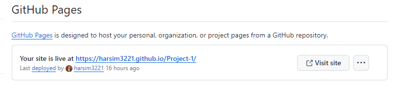

# Project-1

Description of the project :

This Project is based on checking the accessibility standards.
Semantic HTML elements used to define different contents of the web page.
HTML & css elements used for styling and positioning purpose in the web page.
Accessible `alt` attributes follow Images and icon elements.
Added alt text to images and introduced HTML id attribute to specify a unique id.

Links Used :

https://www.w3schools.com/html/html5_semantic_elements.asp

https://www.w3schools.com/tags/att_img_alt.asp

Link to deployed application :

 https://harsim3221.github.io/Project-1/

 Screenshot of the deployed application :

 

